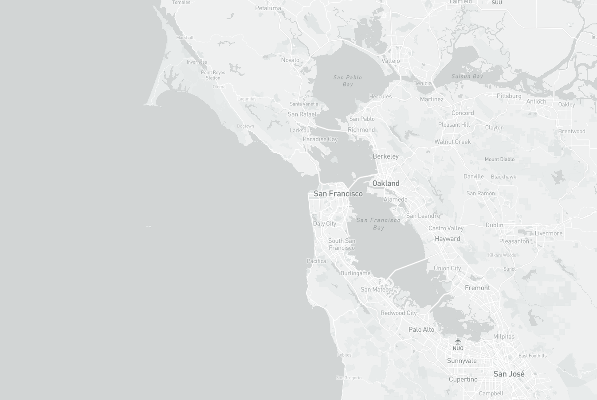
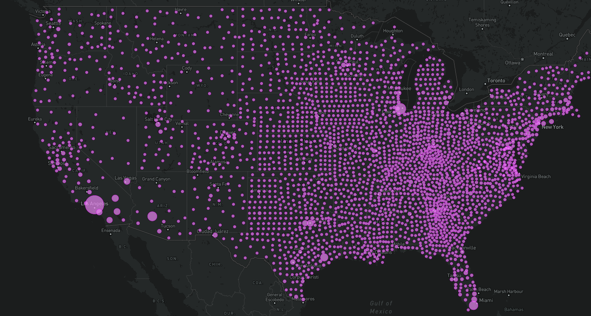
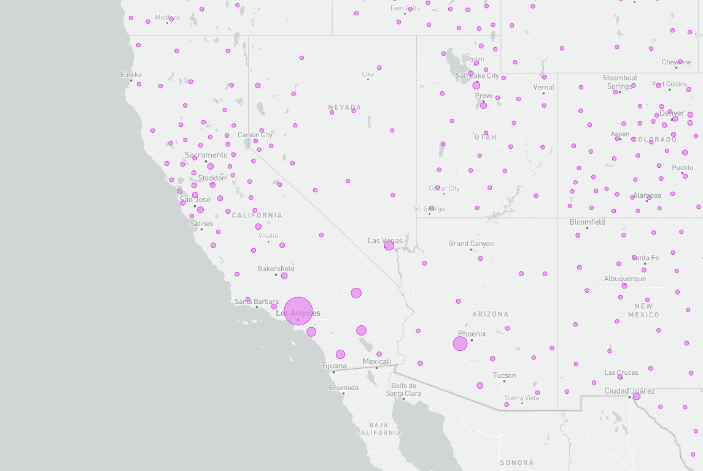
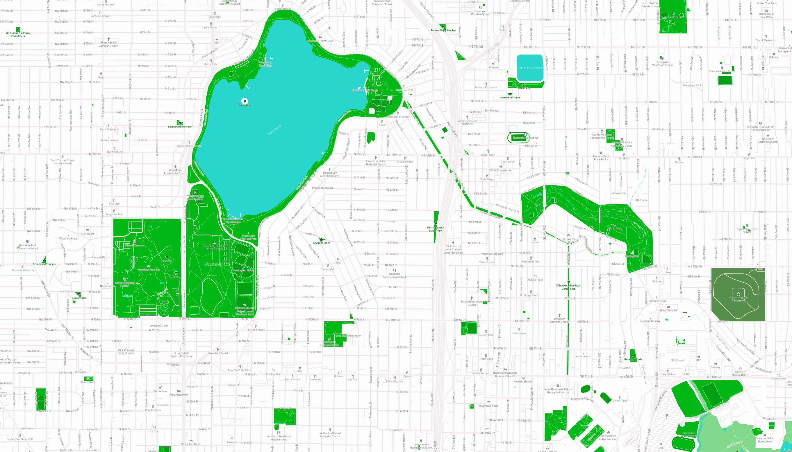

# tileMaps

Access the map at lukehouser.github.io/tileMaps/index.html

For this project I decided to revisit the Covid data in the United States that we used in a previous lab. I found the data on the number of cases by county to be very interesting, so I decided that I wanted to visualize that in this project. My thematic maps are on this subject, however my last map highlights green spaces as I avidly enjoy the outdoors. Each tile set has its minimum zoom set to be 14 and maximum at 18.

## Monochrome

This is a simple monochrome base map.

## Base Covid

This is my first visualization of covid cases by county, presented on a dark base map.

## Monochrome Covid

This is the previous two maps put together, the data is from the Base Covid map and is on the monochrome base map.

## Outdoors

My final map highlights green spaces on the map, by using a vivid green for green spaces and having every other feature be very muted.

### Credits

Covid case data was colleceted by the New York Times. Base maps were created on MapBox. Additonal thanks to Steven Bao and University of Washington Geog 458 TAs.
